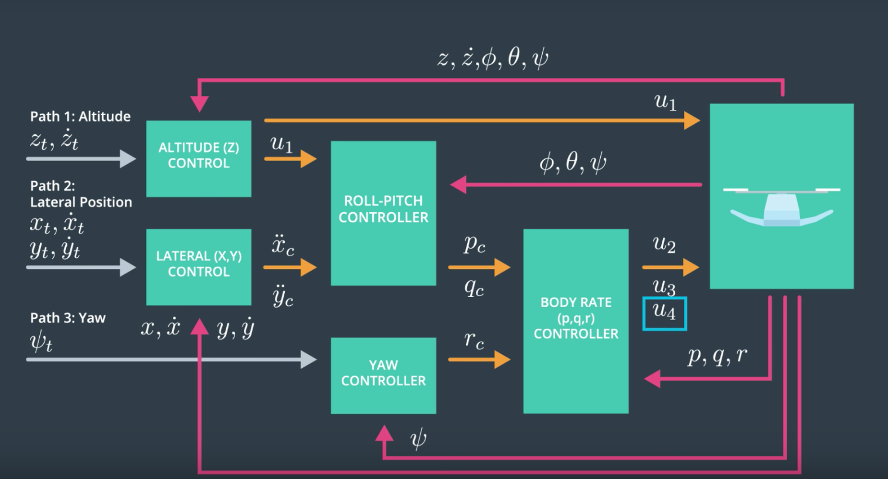

## Building a Drone Controller




# Building a Controller
### Controller Implementation Overview

The controller for the drone has been implemented in C++ to meet the project specifications and achieve stable flight across various scenarios. 
This document outlines the key components of the controller and its performance across different rubrics.

# Body Rate Control

The body rate controller was implemented as a proportional controller that converts body rate commands into moment commands, taking into account the drone's moments of inertia. This controller ensures precise control over the drone's rotation about its axes, taking into account the moments of inertia, Ix,Iy and Iz.

```
    float p_error = pqrCmd[0] - pqr[0];
    float q_error = pqrCmd[1] - pqr[1];
    float r_error = pqrCmd[2] - pqr[2];
    
    float u_bar_p = kpPQR[0]*p_error;
    float u_bar_q = kpPQR[1]*q_error;
    float u_bar_r = kpPQR[2]*r_error;
    
    float momentp = u_bar_p*Ixx;
    float momentq = u_bar_q*Iyy;
    float momentr = u_bar_r*Izz;
    
    momentCmd.x = momentp;
    momentCmd.y = momentq;
    momentCmd.z = momentr;
```


### Roll Pitch Control

The roll pitch controller calculates body rate commands based on the desired x and y accelerations and thrust commands `p_c`, `q_c`, using the vehicle's attitude (φ,ψ,θ). It accounts for the non-linear transformation from local accelerations to body rates and includes the drone's mass in the calculations


```
    float b_x_a = R(0,2);
    float b_y_a = R(1,2);
    float R33 = R(2,2);
    float R21 = R(1,0);
    float R22 = R(1,1);
    float R12 = R(0,1);
    float R11 = R(0,0);
    
    float b_x_c_target = accelCmd[0]*mass/(collThrustCmd);
    float b_y_c_target = accelCmd[1]*mass/(collThrustCmd);
    
    float b_dot_x_c = kpBank*(b_x_c_target - b_x_a);
    float b_dot_y_c = kpBank*(b_y_c_target - b_y_a);
    
    float p_c = (1/R33)*(R21*b_dot_x_c - R11*b_dot_y_c);
    float q_c = (1/R33)*(R22*b_dot_x_c - R12*b_dot_y_c);

    pqrCmd.x = p_c;
    pqrCmd.y = q_c;
```

Also, the controller accounts for the non-linear transformation from local accelerations to body rates. 
This is represented by the first two expressions where the mass of the drone is accounted:

```
    float b_x_c_target = accelCmd[0]*mass/(collThrustCmd);
    float b_y_c_target = accelCmd[1]*mass/(collThrustCmd);
```


### Altitude Control

Altitude control uses the drone's down position (altitude) and velocity (`vertical_velocity`) to compute thrust commands, incorporating the mass of the drone and adjusting for non-linear effects from non-zero roll/pitch angles  `b_z = e[2][2]`. An integrator `integratedAltitudeError` was added to the C++ implementation to handle weight non-idealities.

```
    float b_z = R(2,2);
    
    velZCmd = -CONSTRAIN(-velZCmd,-maxDescentRate,maxAscentRate);
    float e = posZCmd - posZ;
    integratedAltitudeError += KiPosZ*e*dt;

    float u_bar_1 = kpPosZ*(posZCmd - posZ) + kpVelZ*(velZCmd - velZ) + accelZCmd + integratedAltitudeError;
    float accelZ = (u_bar_1 - 9.81f)/b_z;
    if (accelZ > 0){
        accelZ = 0;
    }
    
    thrust = -accelZ*mass;

```


### Lateral Position Control

The lateral position controller uses the local NE position and velocity to generate commanded local accelerations, ensuring the drone can navigate effectively in the X and Y directions.

It generates an acceleration command in the x-y directions which is sent to the roll pitch controller.
The controller uses the local NE position and velocity, `local_position_cmd` and `local_velocity_cmd` and it generates the commanded acceleration below. 
The negative sign shows that the position is in NE.

```
V3F desAccel;

accelCmd[0] = CONSTRAIN(accelCmd[0], -maxAccelXY, maxAccelXY);
accelCmd[1] = CONSTRAIN(accelCmd[1], -maxAccelXY, maxAccelXY);

velCmd[0] = CONSTRAIN(velCmd[0], -maxSpeedXY,maxSpeedXY);
velCmd[1] = CONSTRAIN(velCmd[1], -maxSpeedXY,maxSpeedXY);

desAccel.x = kpPosXY*(posCmd[0] - pos[0]) + kpVelXY*(velCmd[0] - vel[0]) + accelCmd[0];
desAccel.y = kpPosXY*(posCmd[1] - pos[1]) + kpVelXY*(velCmd[1] - vel[1]) + accelCmd[1];

desAccel.x = -desAccel.x;
desAccel.y = -desAccel.y;
desAccel.x = CONSTRAIN(desAccel.x, -maxAccelXY, maxAccelXY);
desAccel.y = CONSTRAIN(desAccel.y, -maxAccelXY, maxAccelXY);

desAccel.z = 0;
```

### Yaw Contro

A simple proportional controller for yaw control converts a desired yaw position into a yaw rate command, ensuring the drone maintains its heading.

```
  yawCmd = CONSTRAIN(yawCmd, -maxTiltAngle, maxTiltAngle);
  yawRateCmd = kpYaw*(yawCmd - yaw);
```

### Motor Commands Calculation

The thrust and moments are converted into the appropriate 4 different desired thrust forces for the quadcopter, with the drone's dimensions taken into account for accurate control.

```
  1)collThrustCmd = f1 + f2 + f3 + f4;
  2)momentCmd.x = l * (f1 + f4 - f2 - f3); // l = L*sqrt(2)/2) - perpendicular distance to axes
  3)momentCmd.y = l * (f1 + f2 - f3 - f4);
  4)momentCmd.z = kappa * f1 - kappa * f2 + kappa * f3 - kappa * f4;
```
where `torque = kappa * thrust`
 
The dimensions of the drone are accounted for in the 2 and 3 equations above:
 
```
float a = momentCmd.x/(L*(1.414213562373095/2));//(L*(1.414213562373095));
    float b = momentCmd.y/(L*(1.414213562373095/2));//(L*(1.414213562373095));
    float c = momentCmd.z/kappa;
    float d = collThrustCmd;

    cmd.desiredThrustsN[0] = ((a+b+c+d)/(4.f));
    cmd.desiredThrustsN[1] = ((-a+b-c+d)/(4.f));
    cmd.desiredThrustsN[3] = ((-a-b+c+d)/(4.f));
    cmd.desiredThrustsN[2] = ((a-b-c+d)/(4.f));

    
    cmd.desiredThrustsN[0] = CONSTRAIN(cmd.desiredThrustsN[0],minMotorThrust,maxMotorThrust);
    cmd.desiredThrustsN[1] = CONSTRAIN(cmd.desiredThrustsN[1],minMotorThrust,maxMotorThrust);
    cmd.desiredThrustsN[2] = CONSTRAIN(cmd.desiredThrustsN[2],minMotorThrust,maxMotorThrust);
    cmd.desiredThrustsN[3] = CONSTRAIN(cmd.desiredThrustsN[3],minMotorThrust,maxMotorThrust);


```


### Performance Metrics
The C++ controller successfully navigated the drone through the test trajectory, meeting all specified performance metrics and ensuring stable flight across all scenarios, including handling the non-linearities of scenario 4 effectively.


