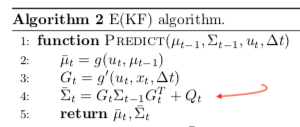

# Estimation Project 

In this project, the estimation portion of the controller used in the CPP simulator has been implemented, in addition the simulated project will use this [control part | https://github.com/AlessandroGulli/Flying-Car-and-Autonomous-Flight-Engineer/tree/main/Drone-Control], previously implemented.

## Setup 

This project will continue to use the C++ development environment you set up in the Controls C++ project.

 1. Clone the repository
 ```
 git clone https://github.com/udacity/FCND-Estimation-CPP.git
 ```

 2. Import the code into your IDE like done in the [Controls C++ project](https://github.com/udacity/FCND-Controls-CPP#development-environment-setup)
 
 3. Compile and run the estimation simulator just as you did in the controls project


### Project Structure


 - The EKF was implemented in `QuadEstimatorEKF.cpp`

 - Parameters for tuning the EKF are in the parameter file `QuadEstimatorEKF.txt`

 - Turning various sensors (the scenarios configure them, e.g. `Quad.Sensors += SimIMU, SimMag, SimGPS`), additional sensor plots will become available to see what the simulated sensors measure.

 - The EKF implementation exposes both the estimated state and a number of additional variables. In particular:

   - `Quad.Est.E.X` is the error in estimated X position from true value.  More generally, the variables in `<vehicle>.Est.E.*` are relative errors, though some are combined errors (e.g. MaxEuler).

   - `Quad.Est.S.X` is the estimated standard deviation of the X state (that is, the square root of the appropriate diagonal variable in the covariance matrix). More generally, the variables in `<vehicle>.Est.S.*` are standard deviations calculated from the estimator state covariance matrix.

   - `Quad.Est.D` contains miscellaneous additional debug variables useful in diagnosing the filter. You may or might not find these useful but they were helpful to us in verifying the filter and may give you some ideas if you hit a block.


#### `config` Directory 

In the `config` directory, in addition to finding the configuration files for the controller and the estimator, you will also see configuration files for each of the simulations.  
For this project, the simulations are from 06 through 11 (for a better response looking at the configuration for the simulation)

As an example, if we look through the configuration file for scenario 07, we see the following parameters controlling the sensor:

```
# Sensors
Quad.Sensors = SimIMU
# use a perfect IMU
SimIMU.AccelStd = 0,0,0
SimIMU.GyroStd = 0,0,0
```

This configuration tells us that the simulator is only using an IMU and the sensor data will have no noise; for each simulator these parameters will change slightly as additional sensors are being used and the noise behavior of the sensors change.

### Implementation details

### 1. Determine the standard deviation of the measurement noise of both GPS X data and Accelerometer X data. 

I've determined the standar deviation of GPS and Accelerometer data as follows: 

I picked the data from `Graph1.txt` and `Graph2.txt`, respectively GPS and accelerometer, and extracted the standard devitiation using the following python code:

```
import numpy as np

vals = np.loadtxt("g2.txt", delimiter=",", skiprows=1, usecols=1)
std_dev = np.std(vals)

print(std_dev)

```

The results were:

```
MeasuredStdDev_GPSPosXY = 0.7221354406057051
MeasuredStdDev_AccelXY = 0.5131842554409878
```

### 2. Implement a better rate gyro attitude integration scheme in the `UpdateFromIMU()` function.

The purpose of this task is finding the estimated Pitch and Roll angles.


First of all I computed the quaternion from the ready-to-use project implementation:

```
Quaternion<float> qt = Quaternion<float>::FromEuler123_RPY(rollEst, pitchEst, ekfState(6));

```

Second, I opted to direct apply the built in integration method as follows:

```
qt.IntegrateBodyRate(gyro, dtIMU);
```

and afterwards retrieving the predicted values from the quaternion:

```
qt.Roll()
qt.Pitch()
```

### 3. Implement all of the elements of the prediction step for the estimator.

Transposed in code the `RGB'` matrix from the document as follows:


```
    float sinPhi = sin(roll);
    float cosPhi = cos(roll);
    float sinTheta = sin(pitch);
    float cosTheta = cos(pitch);
    float sinPsi = sin(yaw);
    float cosPsi = cos(yaw);
    
    RbgPrime(0, 0) = -cosTheta * sinPsi;
    RbgPrime(0, 1) = -sinPhi*sinTheta*sinPsi -cosTheta*cosPsi;
    RbgPrime(0, 1) = -cosPhi*sinTheta*sinPsi+sinPhi*cosPsi;
    
    RbgPrime(1, 0) = cosTheta * cosPsi;
    RbgPrime(1, 1) = sinPhi*sinTheta*cosPsi-cosPhi*sinPsi;
    RbgPrime(1, 2) = cosPhi*sinTheta*cosPsi+sinPhi*sinPsi;
```


G prime was calcuated with the following formula:


Take the python code from lesson:

```
def g_prime(self,u):
    
    g_prime=np.identity(self.mu.shape[0])
    g_prime[0,3] = self.dt
    g_prime[1,4] = self.dt
    g_prime[2,5] = self.dt
    g_prime[3:6,5:6] =np.matmul(self.R_bg_prime, (u[:3]*self.dt) )
    
    return g_prime
```

and the ` C++` code:

```
  MatrixXf u(3,1);
  u(0,0) = accel.x*dt;
  u(1,0) = accel.y*dt;
  u(2,0) = accel.z*dt;
    
  MatrixXf m = RbgPrime * u;
    
  gPrime(0,3) = dt;
  gPrime(1,4) = dt;
  gPrime(2,5) = dt;

    
  gPrime(3,6) = m(0,0);
  gPrime(4,6) = m(1,0);
  gPrime(5,6) = m(2,0);
```

The updated (estimated) covariance was calculated from the equation:



```
ekfCov = gPrime*ekfCov*gPrime.transpose() + Q;
```

The `PredictState()` fuction makes a simple prediction by integrating the accelerations and velocities:

The `accel` input accelerations are in the body frames so we convert them to the inertial frame by using `attitude.Rotate_BtoI(accel)`.

Also, it is noted that we should account for gravity because it is not added to the values:

```
V3F att = attitude.Rotate_BtoI(accel) + V3F(0,0,-9.81f); /*The acceleration (accel) is without gravity*/
```

And simplistic integrations:

```
  predictedState(0) += ekfState(3)*dt;
  predictedState(1) += ekfState(4)*dt;
  predictedState(2) += ekfState(5)*dt;
  predictedState(3) += att.x*dt;
  predictedState(4) += att.y*dt;
  predictedState(5) += att.z*dt;
```

### 4. Implement the magnetometer update.

The magnetometer update asks for the `hPrime` and  `z_t` (named `zFromX` in the project):


```
zFromX(0)=ekfState(6);
```

```
hPrime(0,6)=1 //(Eveything else is zeros)
```


and normalize the difference between the measured and estimated yaw:

```
    float d = z(0) - ekfState(6);
    if (d > F_PI) z(0) -= 2.f*F_PI;
    if (d < -F_PI) z(0) += 2.f*F_PI;
```

### 5. Implement the GPS update.

*The estimator should correctly incorporate the GPS information to update the current state estimate.*

In the `UpdateFromGPS` method we're asked to calculate `hPrime`:


and `z_t`:


This was done with a simple for-loop:

```
    for (int i=0;i<6;i++){
        hPrime(i,i) = 1;
        zFromX(i) = ekfState(i);
    }
```

The estimated values were simple taken from `ekfState` as you can see above.


### The Tasks 

Once again, you will be building up your estimator in pieces.  At each step, there will be a set of success criteria that will be displayed both in the plots and in the terminal output to help you along the way.

Project outline:

 - Step 1: Sensor Noise
 - Step 2: Attitude Estimation
 - Step 3: Prediction Step
 - Step 4: Magnetometer Update
 - Step 5: Closed Loop + GPS Update

### 1 - Sensor Noise

1. **Run the Simulator**: Launch the simulator as previously done, selecting the `06_NoisySensors` scenario. This scenario focuses on capturing sensor data from a stationary quadrotor.

2. **Observation**: In this scenario, the quad remains static, allowing for the observation of sensor noise through two plots:
   - GPS X position
   - Accelerometer X measurement

   The plots display dashed lines representing a single standard deviation from 0 for each signal, based on initially arbitrary standard deviation values.

3. **Data Logging**: The simulation records sensor data to CSV files:
   - GPS X data → `config/log/Graph1.txt`
   - Accelerometer X data → `config/log/Graph2.txt`

4. **Standard Deviation Calculation**: Analyze the logged data to determine the standard deviation for both the GPS X signal and the IMU Accelerometer X signal.

5. **Configuration Update**: Input the calculated standard deviations into `config/6_Sensornoise.txt`, adjusting the values for:
   - `MeasuredStdDev_GPSPosXY`
   - `MeasuredStdDev_AccelXY`

6. **Verification**: Re-run the simulator with the updated settings. Correctly estimated standard deviations will turn the dashed lines in the simulation green, signifying that approximately 68% of measurements fall within the +/- 1 sigma bound, aligning with expectations for a Gaussian noise model.

#### Success Criteria

The correctly estimated standard deviations should encompass roughly 68% of the sensor measurements, validating the noise model's accuracy.


### 2 - Attitude Estimation

Enhanced the quadrotor's attitude estimation by refining the complementary filter-type attitude filter with a superior rate gyro attitude integration scheme.

1. **Run the `07_AttitudeEstimation` Scenario**: This simulation uses the IMU as the sole sensor with noise levels set to zero. Observe the errors in estimated Euler angles and the disparity between true and estimated angles.

2. **Code Implementation**: In `QuadEstimatorEKF.cpp`, enhance the `UpdateFromIMU()` function by implementing a better rate gyro attitude integration scheme to minimize attitude estimation errors.


3. **Success Criteria**: Achieved an attitude estimation error within 0.1 rad for each of the Euler angles for at least 3 seconds.


### 3 - Prediction Step

Implemented the prediction step of the filter to improve the estimated state's tracking of the actual state.

#### Procedure

1. **Run the `08_PredictState` Scenario**: Initially, the estimated state will not accurately follow the true state due to the perfect IMU assumption.

2. **State Prediction Implementation**: In `QuadEstimatorEKF.cpp`, enhanced the `PredictState()` function to allow the estimator state to closely track the actual state, minimizing drift.


3. **Introduce IMU Noise**: Executed the `09_PredictionCov` scenario with a realistic, noisy IMU. Noticed the discrepancy in estimated covariance and growing errors.

4. **Covariance Prediction Enhancement**: Calculate the partial derivative of the body-to-global rotation matrix within `GetRbgPrime()` and complete the prediction step in `Predict()` to predict the state covariance forward accurately.

5. **Parameter Tuning**: Adjusted `QPosXYStd` and `QVelXYStd` in `QuadEstimatorEKF.txt` to reflect the error magnitude accurately over a short prediction period.


**Success Criteria**: This step does not include specific measurable criteria but aims for a reasonable covariance prediction that aligns with observed data for a short prediction period.


### 4 - Magnetometer Update for Heading Estimation

#### Objective
Enhanced filter's heading estimation accuracy by incorporating magnetometer data, addressing the drift in estimated yaw observed when relying solely on the accelerometer and gyro.

#### Procedure

1. **Run the `10_MagUpdate` Scenario**: This test uses a realistic IMU setup but lacks magnetometer integration, leading to noticeable drift in the estimated yaw. The simulation visualizes the yaw error (`quad.est.e.yaw`) and its growing estimated standard deviation (white boundary).

2. **Parameter Tuning**: Adjusted the `QYawStd` in `QuadEstimatorEKF.txt` to align the estimated standard deviation closely with the observed magnitude of yaw drift.

3. **Magnetometer Integration**: Implemented the magnetometer data update in the `UpdateFromMag()` function. 

#### Success Criteria

- **Estimated Standard Deviation**: Should closely match the actual error magnitude, effectively indicating the confidence in the yaw estimation.
- **Yaw Error**: Maintained a heading error of less than 0.1 rad for at least 10 seconds within the simulation.


### 5 - Closed Loop + GPS Update

Refined the position and velocity estimation accuracy of your filter by incorporating GPS data, overcoming the limitations observed with an ideal estimator and IMU.

#### Procedure

1. **Initial Evaluation with Ideal Components**:
   - Run the `11_GPSUpdate` scenario.
   - Observed position and velocity errors despite ideal conditions due to the absence of GPS data integration.

2. **Integration with Your Estimator**:
   - Disabled the ideal estimator by setting `Quad.UseIdealEstimator` to 0 in `config/11_GPSUpdate.txt`.
   - Rerun the scenario to evaluate your estimator's performance with an ideal IMU.

3. **Realistic IMU Simulation**:
   - Modified `config/11_GPSUpdate.txt` to include realistic IMU noise.

4. **Process Noise Tuning**:
   - Adjusted the process noise model in `QuadEstimatorEKF.txt` to align the estimated uncertainty (standard deviation) with the observed errors.

5. **GPS Data Update Implementation**:
   - Implemented the GPS update mechanism in the `UpdateFromGPS()` function to enhance position and velocity estimation.

6. **Final Evaluation**:
   - Re-executed the simulation with the GPS data update in place.
   - The goal is to maintain an estimated position error of less than 1 meter throughout the entire simulation cycle.

#### Success Criteria

- **Position Error**: Successfully completed the simulation with an estimated position error of less than 1 meter, indicated by a green box over the bottom graph in the simulation.


